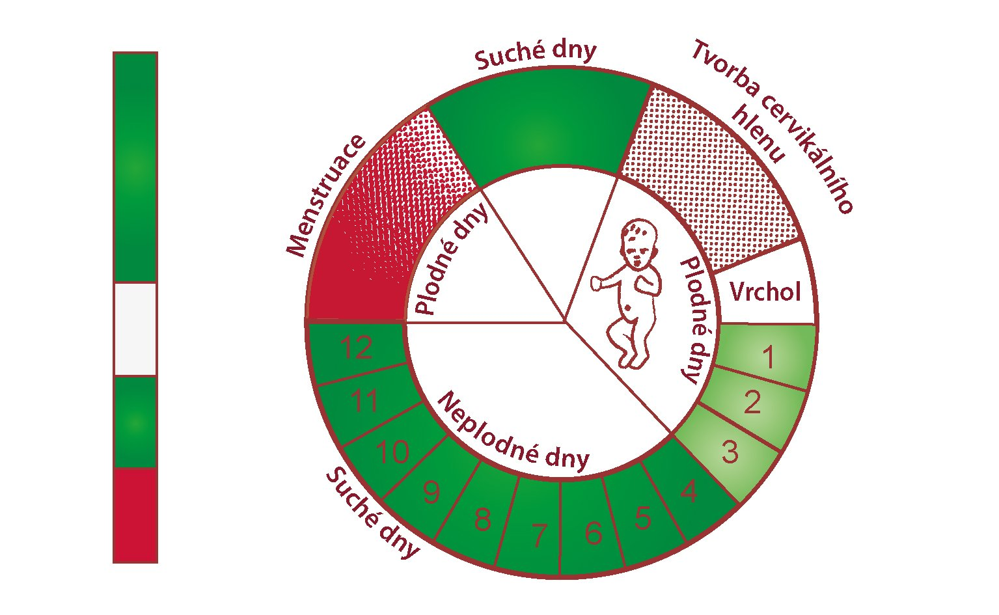

# CRMS

Web aplikácia určená na zapisovanie pozorovaní pre Creightonský model.

 

## Local development

```bash
docker-compose up
```

Po spustení je aplikácia dostupná na `http://localhost:8080`, a je prázdna - treba si registráciou vytvoriť účet.

DB Adminer je dostupný na `http:localhost:8085`, login: `root`, password: `example`
